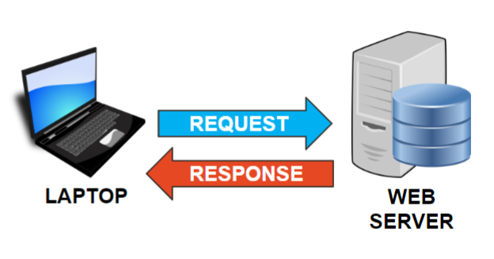
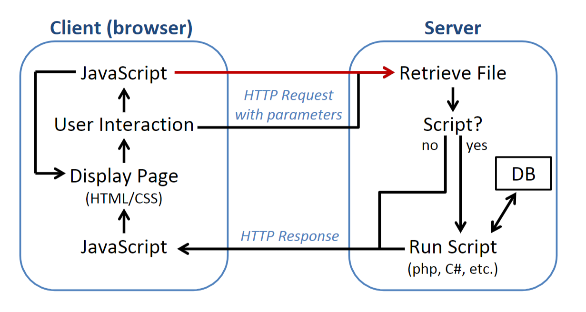

# HTTP Client-Server Model

World Wide Web operates as a global network of interconnected servers and clients, using HTTP protocol.

A client is a piece of software, usch as an web browser on the user's machine that initiates a request for resources.

The client initiates HTTP requests to servers by specifying a Uniform Resource Locator (URL), which includes both resource's location and the specific path.

The request also contains a verb which may indicate what behaviour client is expecting. i.e., "GET img/image.jpg" would be sent to the server to retrieve a image in the "img" directory.

An image of a laptop computer with an arrow labelled "REQUEST" pointing at another computer.
The second computer is labelled web server and has an arrow pointing back to the laptop labelled "RESPONSE".



## Server & AJAX

The server is also a piece of software, usually running on another computer.

The server's address & port number tells responding machine which piece of software the communication is routed to.

The software then processes request, and creates an HTTP response that includes requested content.
- Usually in a text format such as HTML, JSON, or XML

Browsers interpret received text and fetch additional resources like CSS, JavaScript, images, and other resources through additional HTTP requests.

In modern web development, AJAX (Asynchronous JavaScript and XML) allows web pages to send asynchronous HTTP requests to servers without reloading the entire page and refreshing browser's memory state.
- Allows for dynamic content generation

AJAX interacts with the server in background, updating specific parts of web page without disrupting the user's flow.

## Client to Server workflow


This image shows 2 boxes:
- Within client box, the execution flow of a web page is represented.

1. An arrow from client to the server shows an HTTP request, possibly with parameters being sent to the server
2. The server then retrieves a file
3. If the file is a script it has to be run (might also trigger communication with database server)
4. When script completes, or if the file was not a script, HTTP response is sent to client
5. On client side:
  - JavaScript might be executed
  - Document Object Model (DOM) may be constructed, and the page is displayed
6. During user interaction, additional JavaScript may be activated that either:
  - Changes the page's appearance (dynamic html)
  - Or triggers communication with the server, starting another cycle of server executions
7. If additional JavaScript triggers, and the communication was an AJAX request, then the page may not need to be reloaded

## AJAX and REST APIs

REST (Representational State Transfer) APIs provide standardized interfaces to web servers.
REST allow clients to access, manipulate resources using HTTP methods (GET, POST, PUT, DELETE), enabling efficient data exchanges.

Both AJAX and REST APIs can RESPOND to client's request in various formats, such as JSON or XML, and client is able to perform actions based on the server's response.

An important point about REST APIs is that client may not be a web browser, but may be a piece of software using HTTP to communicate.

By leveraging AJAX and REST APIs, modern web applications deliver interactive, responsive, and seamless user experiences, making the World Wide Web a powerful platform for information dissemination and communication.

## Architecture of PHP

- Client typically refers to web browser, or user's device
- Server typically refers to remote computer hosting web application

PHP *acts as an intermediary between client-server*, facilitating:
- Dynamic generation of web pages
- Processing of user requests

-----

## Roles of PHP

PHP plays a crucial role in client-server architecture of web development, acting as a server-side script language. 

The role of PHP in client-server architecture can be understood through the following steps:

### 1. Request Initiation

When a user interacts with a web application, such as submitting a form or clicking on a link, web browser sends an HTTP request to web server. This request contains:
- Info about the action the user performed
- May include data submitted via form fields, or query parameters.
- The HTTP Request Header

#### HTTP request headers

Part of the data sent by client (usually web browser) to web server when requesting a web page or resource, contains:
- Info about client
- Info about requested resource
- Additional details (relevant to request)

For an introductory PHP programmer, it's essential to know that request headers include information like:

**Request Method:** The type of HTTP method used
- e.g., GET, POST, PUT, DELETE, etc
- i.e., in a form submission, the method might be POST.

**Request Uniform Resource Identifier (URI):** Specific resource client wants
- e.g., web page, image, file

**User-Agent:** Identifies client software making request.
- It helps servers understand formatting response based on client's capabilities.

**Host:** The hostname of web server

**Accept:** Types of content client can handle
- e.g., HTML, JSON, XML

### 2. Web Server Processing

Upon receiving HTTP request, web server forwards request to the appropriate server-side application for processing.
In the case of PHP, the web server:
1. Recognizes .php files
2. Hands request over to PHP interpreter

#### PHP Script Execution

By PHP interpreter, in the following order:
1. Process PHP script
2. Execute code
3. Perform various tasks

PHP has access to various server-side resources, and interact with data sources, to generate dynamic content. Such as:
- Databases, Files, External APIs

#### PHP Dynamic Content Generation:

As PHP executes script, it can generate dynamic content in real-time such as HTML, CSS, JavaScript, based on:
- Data from user
- Data retrieved from databases

From the perspective of PHP, it is just outputting strings, it is up to the developer to ensure that the string makes sense as HTML, CSS, or JavaScript.

### 3. Web Server Response

After processing PHP script and generating dynamic content, PHP sends result back to web server.

The generated content is typically HTML text, which web server includes in HTTP response.

The web server:
1. Packages PHP-generated content into an HTTP response
2. Sends HTTP response back to client (web browser).
3. The client's web browser interprets received HTML, CSS, and JavaScript to display the final web page

#### HTTP Response Headers

Part of the data sent by web server's response

These headers contain information about:
- The server
- Content being served
- Caching instructions
- Other relevant details

#### Detailed response headers (important):

**HTTP Status Code:**
- Such as 200 (OK), 404 (Not Found), 500 (Internal Server Error), etc

**Content-Type:**
- Such as text/html for HTML content
- application/json for JSON data

**Content-Length:**
- Size of response content, in bytes.

**Set-Cookie:**
- Set cookies on client's side for managing sessions, or user-specific data.

-----

## Conclusion

Through this interaction, PHP enables the creation of dynamic, data-driven web applications.

It allows developers to:
- Build web pages that respond to user inputs
- Fetch and process data from databases
- Generate content tailored to individual users or specific conditions

PHP's ability to interact with web servers and databases makes it an essential component of client-server architecture, facilitating the delivery of dynamic content and enhancing user experiences on web.

-----

# Web Application Development Model

## What is a web application?

A software program or service that users access through a web browser over Internet.
- It operates on web servers
- It is built using a combination of frontend and backend technologies

**Frontend handles:**
- UI creation
- Presentation
- Layout
- User experience

**Server side handles:**
- Logic
- Processing
- Data management

The server-side resources work behind scenes to process:
- User requests
- Manage data
- Generate responses
- Creating a dynamic experience for users
- Enabling "Cloud" based  web applications such as:
  - Google Docs/Drive/Sheets
  - Chat / messaging applications

Server-side resources may:
- Interact with databases to store
- Retrieve data
- Access other servers

Web applications allow users to:
- Submit forms
- View dynamic content
- Interact with other users

## Advantages of web application
- Without need for users to install any software
- Widely used for a wide range of purposes

For companies they provide a subscription model for monthly payment

-----

## Stacks

Different software, programming, framework technologies and languages used together to build and run web apps. 

### Frontend Stack
Technologies used to create visual part of a web application:
**HTML**
  - For content

**CSS**
  - For styling

**JavaScript**
  - For client side programs

**Frontend Frameworks:**
  - Libraries or frameworks like React, Angular, or Vue.js 
  - Provide pre-built components and tools to streamline frontend development.

### Backend Stack

Technologies used to handle:
- Server-side operations
- Data processing
- Business logic management of a web application

**Server-Side Language:**
- PHP, Python, Ruby, or Node.js
- Implement server-side functionality

**Backend Frameworks:**
- Express.js, Django (Python), or Laravel (PHP)
- Provide pre-built modules to simplify backend development

**Databases:**
- MySQL, PostgreSQL, MongoDB, or SQLite
- Store and manage data for web application.

**Server Environment** - The infrastructure, such as:
- Apache, Nginx, or Microsoft IIS
- Host & run web application.

Popular examples of web development stacks:
- **LAMP:** Linux, Apache, MySQL, PHP/Python/Perl
- **MEAN:** MongoDB, Express.js, Angular, Node.js
- **MERN:** MongoDB, Express.js, React, Node.js

Selecting an appropriate stack depends on factors such as:
- Project requirements
- Scalability
- Performance
- Development team-expertise

#### Server-side scripts

- Scripts that runs on web server
- Executed when the web server receives an HTTP Request
- Help create HTTP Response to send back to user, by filling in content & other details
- Once completes, HTTP Response is sent and program terminates.

This course will focus on LAMP stack from point of view of a backend developer.

-----

### Full Stack

The combination of chosen frontend and backend technologies forms full "stack"

-----

## Software Development Lifecycle

Consists of several phases, each with its own activities and goals.

**DDIT model:**: Define, Design, Implement, Test

### Requirements Analysis (DEFINE): 

Gathering requirements from:
- Assignment documents
- Ask your professor questions to clarify details

Other sources like:
- Rubrics will help guide you to understand what finished product must accomplish.

### Planning (DESIGN): 

- Consider what technologies are required to solve problems identified in your requirements analysis

- Plan how these technologies interact with one another

- Consider program flow that includes both client & server side

- We will have multiple programs that can be run in many different orders.

- Storyboards and flow charts can help to organize your work and keep details clear.
        
### Local Development (IMPLEMENT): 

- Server side software development requires an environment to run programs in, i.e., Python, Java

In client side programming, we didn't use development environment, because our browser acted as a development environment, including console for debugging

In server side programming, difficulty is that browser cannot interpret PHP code. We can set up our back end stack on our local computer, and then we can direct output of stack to browser.

One of simpler ways to do this is with a program like WAMP (W for Windows, AMP like LAMP).

This is one reason these notes refer to client and server as pieces of software instead of as different machines. If you install WAMP on your local machine, and view page in a browser on same computer, you will have both server and client on same computer. More on this in first lab. For now, just focus on idea that with help of a special piece of software, you're building your web application on your own machine.
        
### Testing (TEST): 

As with any software development, it's very important to take time to create and to use test cases to check functionality of your solution. In web application development, errors can expose details of system leading to security vulnerabilities. Choosing appropriate tests that confirm both that program works and also that it fails in predictable ways is critical. Testing that components developed separately work together, called integration testing , becomes very necessary when building larger web applications.
        
### Remote Deployment: 

When you are confident that your solution works well, you will want to make it available to world on Internet. We sometimes call server that you will move code to as a "production server", meaning it's real one that your users interact with, not just test environment on your machine. We almost never develop web applications on production server, as it could result in users seeing test code, or experiencing disruptions as we try to fix bugs. In this course we will use CSUNIX as our production server. Keep in mind that you may be using multiple servers in your code, web sever and database server, and you need to deploy your solution to all of them to make software work correctly remotely.
        
### Testing: 

Once we have moved our code onto production server, it is important to confirm that it still works in same way as when we had it on our development server. One common issue is that Windows has different operating system rules for file names than a Linux system, so things like case sensitivity or allowing spaces in names changes from one system to other. We may also use some test credentials in our database system that differ from requirements of our production server, so it is important to verify that it all works right, and debug whole system before making it "live".

-----

# Server Side Programming Languages

## Python

### Purpose
- General Porposed language
- Simplicity and readability
- Widely used for web development, data science and scription tasks

### Syntax
- Emphasizes on readibility and conciseness
- Easy to learn

### Compatibility
- Can be used in various web servers
- Can be used in frameworks like Django and Flask

### Ex1
- Extensive libraries to enable rapid prototyping and web development

### Ex2
- Strong data manipulation capabilities
- Having libraries like NumPy & Pandas makes it a powerful choice for data-intensive web app

-----

## Java

### Purpose
- A versatile language used for applications including server-side web development
- Popular in enterprise-level projects
- High scalability
- High reliability

### Syntax
- More verbose compared to PHP and JavaScript
- Strong typed (strict on variable type defining and conversion)
- Object-oriented

### Compatibility
- Various web & application servers that support Java Servlets and JavaServer Pages (JSP)
  - e.g., Apache Tomcat, JBoss

### Ex1
- High performance 
- Very good at handling high-traffic scenarios

### Ex2
- Very portable: "write once, run anywhere"

-----

## JavaScript

### Purpose
- Mainly used for client-side web development
- Providing interactivity & enhanced user experiences on web browser

### Syntax
- C-like syntax, similar to PHP, but:
  - JavaScript is an interpreted language
  - JavaScript is primarily executed on the client-side within web browsers

### Compatibility
- Traditionally, JavaScript was not used for server-side development
- Node.js allowed JavaScript for server-side programming

### Ex1
- Known for its asynchronous capabilities, which:
  - Allow handling multiple requests concurrently
  - Allow making it suitable for real-time apps

### Ex2
- Works on both client & server sides (full-stack development) process:
- Easier code sharing
- Easier code unification

-----

## PHP

### Purpose
- Specifically designed for web development
- A natural choice for server-side tasks
- Widely used for:
  - Building dynamic web pages
  - Handling form submissions
  - Interacting with databases.

### Syntax
- Similar to C-style languages
- Relatively easy for developers familiar with languages like C, C++, or Java

### Compatibility
- Primarily designed to work with web servers like Apache, NGINX
- A popular choice for shared hosting environments

### Ex1
- Large & active community, resulting:
  - A vast collection of libraries, frameworks (e.g., Laravel, Symfony)
  - Lots of resources available for developers

### Ex2
- Fast execution
- Optimized for web server task

-----

Each language has its own niche and set of advantages for server-side web development.

**PHP**
- Excels in web-specific tasks
- Allow shared hosting environments.

**JavaScript**
- Require Node.js for server-side availability
- Unified full-stack development experience

**Java**
- Well-suited for enterprise-level projects

**Python**: Simplicity and Data manipulation capabilities make it excellent for:
- Data-centric web applications
- Rapid prototyping

Developers often choose the language based on the specific requirements and characteristics of the project they are working on.

-----

# Introduction to PHP, Data Types, and Strings

## Things You Know from Python, Java, and JavaScript

### General Similarities

#### Python
```
age = 25
name = "John"
is_student = True
```

#### Java
```
int age = 25;
String name = "John";
boolean isStudent = true;
```

#### JavaScript
```
let age = 25;
let name = "John";
let isStudent = true;
```
#### PHP
```
$age = 25;
$name = "John";
$isStudent = true;
```

PHP uses:
- **C-style syntax** for conditions and loops
- **Curly braces** `{}` to define code blocks (like Java and JavaScript)
- **Semicolons** `;` to terminate statements

All language support comments with single-line:
- `//` in JavaScript, Java, and Python
- `//` or `#` in PHP

and multi-line
- `/* */` in JavaScript, Java, and PHP
- `"""` or `'''` in Python formats

**Interpreted language**
- Not compiled to an executable
- [x] PHP, Python, JavaScript
- [] Java

**Imperative programming**
- Not 'declarative' (No classes or main required)
- [x] PHP, Python, JavaScript
- [] Java

- Variable names in PHP are case sensitive.

All languages support:
- Basic data types like boolean, integers, floating-points, and strings.
- Arrays (lists in Python)
- Objects and classes, enabling object-oriented programming

PHP is weakly typed like JavaScript

PHP supports the === operator

-----

### General Differences

PHP uses the $ symbol to declare variables (e.g., $variableName), while JavaScript, Java, and Python do not require a specific symbol for variable declaration.

PHP, JavaScript, and Python are dynamically typed languages:
- Type declarations for variables are not required
- Type can change during runtime.
- Java uses explicit type declarations (e.g., int, String, bool) when defining variables
- PHP is weakly typed, unlike Python and Java.

**Indentation:**
- Python uses to indicate block structure (e.g., if, while, function)
- PHP relies on curly braces

**Associative arrays**
- Key-value paired array
- Supported by PHP and JavaScript
- Java and Python require special data structures (e.g., HashMap in Java, dictionaries in Python)

Python has additional data types like tuples (immutable sequences) and sets, which are not present in the other three languages

-----

## Weakly Typed Languages

PHP is a weakly typed language. This isn't the same as being dynamically typed.

In a weakly typed language:
- There are never any syntax or run-time errors for mixing types
- You get logic errors instead, which are much harder to debug
- You gain flexibility, performance, and convenience, but you get GIGO: Garbage in, Garbage out

This is legal in PHP:

```
$a = false + 12;

if (null >= 0) { echo "<p>null is 0</p>"; } // PHP converts false/null to 0

if ('hello') { echo "<p>'hello' is true</p>"; } // PHP converts "hello" to a Boolean value.
```

Weak typing is really just a very aggressive form of automatic type casting.

Because it is weakly-typed, PHP contains two new Boolean operators for strict equality (===) and strict inequality (!==).

These operators compare the type and the value, just like JavaScript. Be careful!

You are very strongly encouraged not to rely on this "loose comparison" behaviour as it can, and does, change between PHP versions.

As an example consider this piece of code: 0=="php":
- Below version 8——False
- Version 8 & up——true
- This means relying on weak comparison, an update in PHP would break your code's if statements

This takes us back to a first semester rule about data validation: never trust the user.

If some data came from outside our program, including from databases or from files, we should not trust it until we've validated it. Here we need to validate both the data type and the content as appropriate.

-----

Here's another GOTCHA that comes up because of this behaviour!

Even seasoned programmers make the mistake of using assignment instead of comparison from time to time:
```
$guess = 5;
if ($guess = 6) { echo "<p>You guessed correctly!</p>"; }
else { echo "<p>Sorry, try again.</p>"; }
```
This code used value assignment (=) instead of comparison (==) in the code.

In PHP, this becomes:
1. `$guess = 6` is actually executed
2. `if` detects the condition is greater than 0, which becomes `if (true)`
3. returns `<p>You guessed correctly!</p>`

Some use the trick of putting the literal first to make sure it gets flagged as a mistake.
- This would not won't work with comparing 2 variables
```
$guess = 5;
if (6 = $guess) { echo "<p>You guessed correctly!</p>"; }
else { echo "<p>Sorry, try again.</p>" }
```
Here you will see an error because you cannot assign a value to a literal, which sometimes help you avoid problems

-----

## Major Syntactic Differences

Some other unintuitive differences between PHP and the other languages, and mostly they involve strings.

### PHP Tags

PHP files can mix HTML markup, JavaScript, and PHP code in the same file
- Even though we are going to start out with only PHP code, we will work our way up to that model

#### Embedded PHP code in HTML:
```
<html>
<body>
   <script>console.log('Hello world');</script>
   <?php
      echo '<p>Hello world!</p>';
   ?>
</body>
</html>
```
If you:
1. put this into a file and call it demo.php
2. load it in WAMP/XAMPP/CSUNIX web server
3. Open in web browser
You will see it run the console.log message and give you a page with 1 paragraph saying Hello world!

How does the PHP processor know what is just HTML or JavaScript that should be output exactly as written and what is PHP source code that has to be interpreted?

The `<?php ?>` says: "1. turn on PHP interpreter mode, interpret the following text as PHP"

It's important to understand that you can turn the interpreter on/off multiple times for:
  - Ease of output of blocks of HTML code
  - It will not change variable scope

#### Scope of PHP variables

Variables are scoped to the entire HTML file, so turning the mode on and off won't reset them.

Notice: `$choice` is preserved in the else block
```
<html>
    <body>
        <?php
            $choice = 1;
            if ( $choice == 1 ) {
        ?>

        <div>Imagine this is a big chunk of HTML & BootStrap instead</div>

        <?php
            } else { echo "<p>The choice variable was $choice instead of 1.</p>"; }
        ?>
    </body>
</html>
```
Although a bit of a mess, it's perfectly valid.

Later we'll see that this can be a useful pattern for generating rows from arrays.

#### PHP Shortcut / short echo tag

- `<?= ... ?>` is the short cut for `<?php echo ... ?>`

You can insert any expression for "..." and it will be echoed into your output.

This is most convenient in things like forms:
```
<?php
    $default = "My Tag!";
?>
<form>
    <input type="text" id="mytag" name="mytag" value="<?= $default ?>" >
</form>
```

For example, when echoing data inside HTML, it must be HTML-encoded:

`<?= htmlspecialchars($function_here, ENT_QUOTES) ?>`

Or, when echoing data inside JavaScript, it must be JavaScript-encoded:

`<script>var=<?= json_encode($function_here) ?>`

-----

### PHP Strings in quotes

In PHP, this:

`'<p>Your lucky number is ' . $luckynum . '</p>'`

Is the same as:

`"<p>Your lucky number is $luckynum</p>"`

The single quotes does not expand variables, therefore we can choose to simplfy variable expansion with double-quotes, or prevent variable-expansion with single quotes, in an echo.

However, this variable will not work correctly:

```
$memory = 16;
echo "My computer has $memoryGB of RAM"; // Error
```

But this expands correctly:

```
$memory = 16;
echo "My computer has {$memory}GB of RAM"; // My computer has 16GB of RAM
```

Putting variables in a curly braces is a good habit to allow no-space inbetween variable and other texts.

-----

# Control Structures & Loops in PHP

Control structures (if else, or, and, xor, !, ==, ===, !=, !==) and loops in PHP are fundamental

## Boolean expressions

**AND**: `$a and $b` or `$a && $b`

**OR**: `$a or $b` or `$a || $b`

**XOR**: `$a xor $b`
- Must be "a true and a false"
- `if (($a==true && $b==false) || ($a==false && $b==true))`

**NOT**: `!$a`
- If `$a` is `false`

### Short circuit evaluation

If the left side boolean evaluation passes, the right side boolean evaluation is skipped to save time.

This is frequently used for error checks. A simple example is adding "avoiding division by zero" onto some other condition:

```
$a = 100;
if ($b != 0 && ...) {}
```

The left side `$b != 0` is always executed first, therefore prevents the right side from continuing, if `$b` is actually 0.

### `and` and `&&`

```
$bool = true && false;
echo $bool; // false, as expected

$bool = true and false;
echo $bool; // true, because it evaluates as ($bool = true) and false;

$bool = (true and false);
echo $bool; // false, as expected
```

The `and` sign also follows short circuit evaluation, use `||` or `(... and ...)` if that is unwanted.

Adding parenthesis is not necessarily worse than adding `||`, i.e., it makes the code more readable

-----

## Condition Statements

We use if-else statements to make decisions based on specific conditions. The syntax is similar to Java and JavaScript, but different from Python:
 
**Python**

```
if condition:
    # Code block executed if the condition is true
elif another_condition:
    # Code block executed if the first condition is false and the second condition is true
else:
    # Code block executed if none of the above conditions are true
```

**Java/JavaScript**	

```
if (condition) {}
else if (another_condition) {}
else {}
```

**PHP**	

```
if ($condition) {}
elseif ($another_condition) {}
else {}
```

In PHP, we could omit the `{}` if the code block is one line, but this costs on maintainability, or lead to dangling-else problem

The ternary operator is also nearly identical to the Java and JavaScript operator except for the variable naming conventions but has a second use that is slightly different:

```
// If expr1 is true, run expr 2, else run expr 3.
(expr1) ? (expr2) : (expr3) 


echo true : ? "yep" : "nope" // prints "yep"
```

If you omit the middle expression, the input expression (expr1) will be returned

```
(expr1) ? : (expr2)

echo rand(0,10) ? : "Not Zero";
```

-----

## Switch statements

```
switch ($target) {
    case 1:
        // Code block executed if $variable is 1
        break;
    case 2:
        // Code block executed if $variable is 2
        break;
    default:
        // Code block executed if $variable does not match any case
        break;
}
```

PHP will look for an exact match of the thing you are looking for against the available cases using loose comparisons. Care needs to be taken with string/numeric automatic conversions for this reason. If it doesn't find a match, it will run the default case if it is defined. Note that the variables and literals shown here can be simple expressions. In fact one of the best reasons to use a switch-case structure is to avoid calling a function multiple times during the condition check, especially if the function could return different results at different times.

```
switch ( rand(1, 10) ) {
   case 4: echo 4!; break;
   case 3: echo 3!; break;
   case 2: echo 2!; break;
   case 1: echo 1!; break;
   default: echo Bigger than 4!;
}
```

A continue; statement inside a switch-case statement will simply exit the switch statement, exactly as a break would do. If you want to use this to iterate a loop that the switch-case is nested in, you can use continue 2; instead. Break can also take an integer value to say how many contexts it should break out of. If you had a switch-case inside a loop and the case you had reached told you that you could exit the loop (input trapping maybe?) you can use something like break 2; to achieve this without extra flag variables.

-----

## Loop statements

```
for ($i = 0; $i < 5; $i++) {
    // Code block executed 5 times
}
```

```
$i = 0;
while ($i < 5) {
    // Code block executed as long as $i is less than 5
    $i++;
}
```

```
$i = 0;
do {
    // Code block executed at least once and then as long as $i is less than 5
    $i++;
} while ($i < 5);
```

-----

### For-each loop

**Python**

```
list = [1, 3, 5, 7, 9] 
for i in list:
   print(i)
```

**Java**

```
int[] list = {1, 3, 5, 7, 9};
for(int x : list)
   System.out.println(x);
```

**JavaScript**

```
let list = [1, 3, 5, 7, 9];
list.forEach( (item) => {console.log(item);});
```

**PHP**

```
$list = array( 1, 3, 5, 7, 9);
foreach ( $list as $item )
   echo $item
```

All of these structures can be manipulated with the `break` and `continue` keywords.

-----

# Modular Programming in PHP

## File Level Modularity

AJAX function calls request an entire PHP file to be loaded and run.

To organize functionality, we put one task per file

This fits better with the Client-Server structure, although different

There is no way to directly ask for running a specific function in a PHP file by client-side service, so even if we would prefer to practice traditional function use, it requires a little more thought.

When working with file level modularity, it is common to bring in other files to build our solution.

i.e., when you connect to a database, send some request, process and return the result of the query.
- "connect to database" is probably done by common code that you might put in its own file
- The rest of it might be specific to the task you're performing

PHP provides 4 common methods of importing other files into your current solution: `include`, `include_once`, `require`, and `require_once`.

**`include`**:
- Turn off PHP parsing mode
- Begin process the included file immediately
- If the file is not found or cannot be read, include will issue a warning, and continues
- Similar to what happens when an HTML file imports a script or a CSS file.

**`include_once`**:
- Only import the file if it has not yet been imported
- If the file is not found or cannot be read, include will issue a warning, and continues

**`require`**:
- If the file is not found or cannot be read, include will issue an error, and stops

**`require_once`**:
- Turn off PHP parsing mode
- Begin process the included file immediately
- Only import the file if it has not yet been imported
- If the file is not found or cannot be read, include will issue an error, and stops

-----

## Function Level Modularity

Within PHP files it is often very useful to define functions to keep our code organized
- and to prevent "cut and paste-itis". 

User defined function can be declared with:
- function keyword
- arrow notation
- anonymous functions (aka closures).

#### Examples:

1. [Standard user defined declaration](https://www.php.net/manual/en/functions.user-defined.php)

```
function greet($name) { return "Hello ".$name."!"; }
echo greet( "Student" );
```

2. [Arrow notation](https://www.php.net/manual/en/functions.arrow.php) (also closures/anonymous functions)

```
$greet = fn($name) => "Hello ".$name."!";
echo $greet( "Student" );
```

3. [Anonymous function declaration](https://www.php.net/manual/en/functions.anonymous.php)
  - function without name
```
$greet = function ($name) {return "Hello ".$name."!";}
echo $greet("Student");
```

All of these simple examples can be expanded to be much more useful.

Functions in PHP are scoped the same way variables are, within the context they are defined, which means you can define a helper function inside another function if you wish.

Functions do not need a return type or parameter type. If the function doesn’t execute a return statement, it will return the value null by default.

There is no function overloading in PHP, but you can achieve something similar by using default argument values:

```
<?php
function spam($a, $b=0, $c=0) { return $a + $b + $c; }
?>

<p>
    <?= spam(1) ?><br><br>
    <?= spam(1, 10) ?><br><br>
    <?= spam(1, 10, 100) ?><br><br>
</p>
```

-----

## Object Oriented Programming

Full support for object-oriented programming was added to PHP in version 5. Now you can program using a mix of the two styles.

In this course you will be using existing objects more than creating your own classes, but you are welcome to do so if you feel comfortable.

Here’s an example of a class declaration in PHP:

```
class Person {
   // instance variables
   private $name;
   private $age;

   // constructor function must be named __construct
   public function __construct($name, $age = -1) {
      $this->name = $name;
      $this->age = $age;
   }

   public function get_name() {
      return $this->name;
   }

   public function get_age() {
      return $this->age;
   }

   public function increase_age($increment) {
      $this->age += $increment;
   }
}
```

And here’s how you create objects of type Person. This should all look familiar from Java.

```
$p1 = new Person("Sam");
$p2 = new Person("Anne", 30);
```

Here’s how you access a method. Note the use of the arrow operator (->) for dereferencing instead of the dot operator. The dot operator is reserved for string concatenation in PHP.

`$p1->increase_age(11);`

As we saw earlier, if you want to include a method call inside a double-quoted string, use braces.

`echo "Your name is {$p1->get_name()}.";`

-----

# Model-View-Controller Design

## Model-View-Controller (MVC)

A software design pattern used in web development to:
- Separate an application into Model, View, and Controller
- 3 interconnected components
- To promote modularity:
  - Code organization
  - Reusability
  - Maintainability
  - Responsibility separation

-----

### Model

Represents the application's data and business logic.

Responsible for data storage, retrieval, and manipulation.

Implements the application's core functionality.

Interacts with the database and manages the application's state.

Performs various operations on the data to ensure consistency and accuracy.

For example, the business logic in a web application that manages a user's shopping cart" would:
- Determine how items are added or removed from the cart
- Calculate the total cost of the items
- Apply any discounts or promotions

### View

Responsible for presenting the data to the user interface.

Handles the visual representation and user experience.

Displaying information and responding to user interactions.

Kept separate from the application's business logic
- Ensures a clear distinction between presentation & data processing

Rebranding or redesign can occur with changes to only the view.

Thanks to the use of AJAX & JavaScript (and frameworks like React, Angular, Vue.js, etc), it is possible for the view to be almost entirely defined in client-side.

The server-side would still have a responsibility to provide the data that the view required.

### Controller

Acts as an intermediary between the Model and the View.

It processes user input, interprets commands, and decides which actions to take.

Handles the flow of data between the Model and View, ensuring that user requests are appropriately processed.

